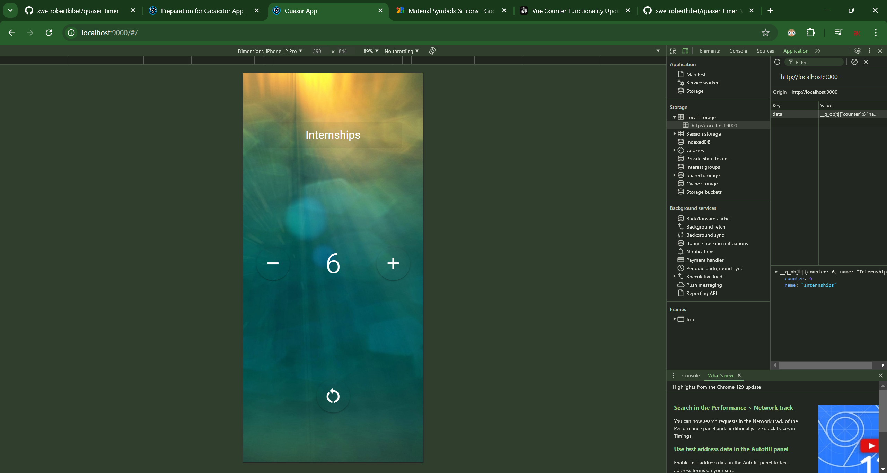

# Counter App

## Description

The Counter App is a simple yet interactive application built with Vue 3, TypeScript, and the Quasar Framework. It allows users to increment, decrement, and reset a counter value. The app features a user-friendly interface where users can also set a name for their counter.

## Features

- **Increment/Decrement Counter**: Easily increase or decrease the counter value.
- **Reset Functionality**: Reset the counter back to zero.
- **User Input**: Users can enter a name for the counter.

## Installation

To set up the Counter App locally, follow these steps:

1. **Clone the repository**:

   ```bash
   git clone https://github.com/swe-robertkibet/quaser-timer.git
   ```

2. **Navigate to the project directory**:

   ```bash
   cd quaser-timer
   ```

3. **Install the dependencies**:

   ```bash
   npm install
   ```

4. **Run the application**:

   ```bash
   quasar dev
   ```

5. **Open your browser** and go to `http://localhost:8080` to view the app.

## Usage

- Enter a name for your counter in the input field.
- Use the "+" button to increment the counter.
- Use the "-" button to decrement the counter, which will not go below zero.
- Click the reset button to set the counter back to zero.

## Technologies Used

- **Vue 3**: The JavaScript framework for building the user interface.
- **TypeScript**: A typed superset of JavaScript that compiles to plain JavaScript.
- **Quasar Framework**: A UI framework for building responsive web apps.
- **JavaScript**: Programming language used for the app's logic.

## Screenshot



## License

This project is licensed under the MIT License.

## Acknowledgments

- [Make Apps with Danny](https://www.youtube.com/watch?v=X5PygyNG71g) for the tutorial that helped guide the development of this app.
- [Vue.js](https://vuejs.org/)
- [Quasar Framework](https://quasar.dev/)
